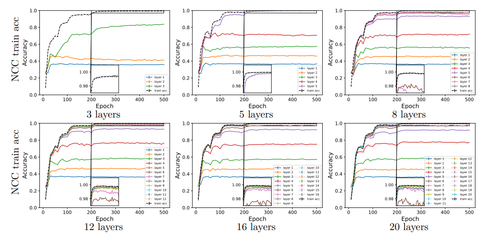

<h1 align="center">Comparative Generalization Bounds for Deep Neural Networks</h1>
</h5>

<hr>

### Project Overview
We study the implicit bias of gradient based training methods to favor low-depth solutions when training deep neural networks. Recent results in the literature suggest that penultimate layer representations learned by a classifier over multiple classes exhibit a clustering property, called Neural Collapse (NC). We show that neural networks trained for classification exhibit a phenomenon where Neural Collapse propagates backward from the penultimate layer to several preceding layers. This reveals a notion of “effective depth” in the model, where the lower layers are responsible for feature learning, classification occurs at an intermediate layer, and the upper layers become redundant during training.  In this regards, we hypothesize that gradient based methods are implicitly biased towards selecting neural networks of minimal depth for achieving this clustering property.

## Requirements
- Python 3.10
- Pytorch 1.11
- Numpy
- Tqdm

## Running Experiments

### Key Files 

* conf/global_settings.py: Defines configuration parameters and hyperparameters for the network, including architecture choice, depth, width, weight decay (WD), learning rate (LR), and options for introducing noisy labels. This file can be customized to experiment with various model and hyperparameter configurations.
* analysis.py: Provides functions to compute key metrics such as Class-Distance Normalized Variance (CDNV), accuracies, losses, and the level of the nearest class center rule. It supports the analysis of hyperparameter effects on model behavior, particularly its effective depth.
* utils.py: Includes functions for saving experimental data, loading datasets, and pre-processing. Supports a range of datasets for training and evaluation.
* models/: Contains implementations of neural network architectures used in experiments, with support for varying depth and width configurations.

### How to Run

1. **Edit Configuration**: Update the `conf/global_settings.py` file with your desired parameters (e.g., architecture, depth, learning rate).

2. **Run the Experiment**: Choose one of the following options:

   - **Option 1: Submit to Slurm**  
     Submit the experiment as a job to Slurm using the command:  
     ```bash
     sh train.sh
     ```

   - **Option 2: Run Directly**  
     Execute the training script directly using Python:  
     ```bash
     python train.py
     ```

<br />

<hr>

### Example Experimental Results  
*(For more details, refer to the paper)*  

We conducted experiments to study **Intermediate NCC Separability** using different architectures and datasets. The results demonstrate the NCC train accuracy rates across neural networks with varying depths.



Figure 1: Intermediate NCC separability of CONV-L-400 (L hidden layers with a width of 400) trained on CIFAR10. The results show how NCC train accuracy evolves across the layers for networks with 3, 5, 8, 12, 16, and 20 layers.

### How to Reproduce Results

#### Training Setup
Use the following training configuration:
- **Batch size**: 128
- **Learning rate schedule**: Initial learning rate of 0.1, decayed three times by a factor of 0.1 at epochs 60, 120, and 160
- **Momentum**: 0.9
- **Weight decay**: 5e−4
- **Epochs**: 500
<hr> 
<h3> Citation </h3>

```bib
@article{galanti2023comparative,
  title={Comparative generalization bounds for deep neural networks},
  author={Galanti, Tomer and Galanti, Liane and Ben-Shaul, Ido},
  journal={Transactions on Machine Learning Research},
  year={2023}
}
```
